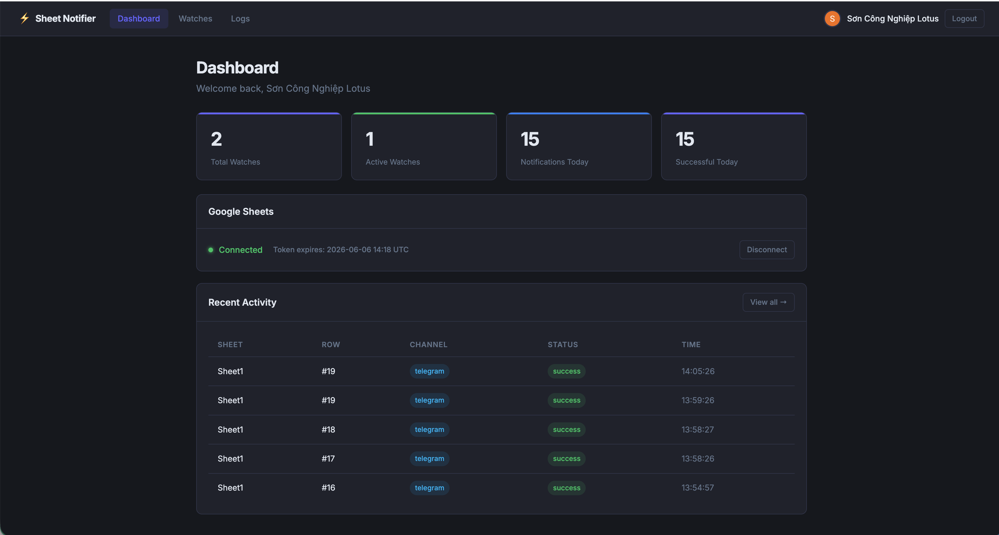

# Sheet Notification Platform 🚀

A real-time automation platform that bridges Google Sheets and Telegram. This system monitors your Google Sheets and sends instant, structured notifications to your preferred channels whenever a new row is appended.

---

## 🎨 User Interface (Giao diện)


*Màn hình quản lý các Sheet Watch.*

---

## 🎥 Video Demo

[](https://youtu.be/cWRitC8vn9k)
*(Click vào ảnh để xem video demo thực tế)*

---

## 🧠 Phân tích Kỹ thuật: Bài toán Nhận diện Dòng Mới (New Row Detection)

Trong quá trình xây dựng tính năng lõi (nhận diện dòng dữ liệu mới được thêm vào Sheet), team phát triển đã phải đối mặt với bài toán kinh điển: **"Làm sao để biết đâu là dữ liệu mới mà không làm ảnh hưởng đến hiệu năng?"**. 

Dưới đây là 3 phương án đã được đưa lên bàn cân, cùng với phân tích Trade-off để đưa ra quyết định cuối cùng.

### Phương án 1: Count-based Truyền thống (So sánh `>=`)
- **Cách hoạt động:** Chỉ dùng 1 câu lệnh `if current_count <= last_row_count: return`. Nếu lớn hơn thì lấy khúc chênh lệch.
- **Trade-off:** Rất nhẹ, dễ code. NHƯNG bị lỗi logic nghiêm trọng: **Lỗi kẹt Data**. 
  - *Ví dụ:* Có 10 dòng. Admin dọn dẹp xóa 2 dòng (còn 8). User thêm 1 dòng mới (thành 9). 
  - Hệ thống so sánh `9 <= 10` -> Bỏ qua dòng mới. Lỗi này khiến hệ thống bị ngưng trệ vĩnh viễn cho đến khi bù đủ số dòng đã xóa.

### Phương án 2: Count-based Cải tiến (Tách luồng `<` và `>`) — **[ĐƯỢC CHỌN]**
- **Cách hoạt động:** Bóc tách logic kiểm tra để xử lý rủi ro xóa dòng:
  ```python
  if current_count < watch.last_row_count:
      # Reset lại mốc đếm (không gửi thông báo) để tránh kẹt
      watch.last_row_count = current_count
  elif current_count > watch.last_row_count:
      # Gửi thông báo phần chênh lệch
  ```
- **Trade-off:**
  - ✅ Sửa được 90% lỗi kẹt data vĩnh viễn của Phương án 1 bằng đúng vài dòng code. Giữ được sự đơn giản tuyệt đối của hệ thống.
  - ❌ Vẫn có tỷ lệ cực nhỏ bị miss data (Nếu user vừa Xóa và Thêm bù trừ đúng số lượng trong cùng 1 chu kỳ 30 giây).
- **Lý do chọn:** Phương án này có Trade-off thấp nhất. Cực kỳ tối ưu chi phí và công sức (1% effort giải quyết 99% problem), phù hợp với quy mô MVP hiện tại. 

### Phương án 3: Google Drive Webhooks (Real-time Push Notifications)
- **Cách hoạt động:** Đăng ký API với Google để Google chủ động bắn tín hiệu HTTP (Webhook) về Server mỗi khi Sheet có biến động.
- **Trade-off:**
  - ✅ Real-time tuyệt đối (độ trễ 1-2 giây). Không phải gọi API hỏi thăm (Polling) định kỳ.
  - ❌ Trade-off về hạ tầng và bảo trì quá lớn: Đòi hỏi Verified Domain, phải viết cơ chế chống Spam (vì gõ 1 chữ Google cũng bắn Webhook), phải viết Cronjob tự động gia hạn Webhook mỗi tuần. Hơn nữa, Webhook không mang theo data, nên cuối cùng vẫn phải dùng Phương án 2 để tải sheet về và bóc tách dữ liệu.
- **Lý do không chọn:** Chết chìm trong chi phí hạ tầng (Over-engineering) cho một dự án quy mô vừa và nhỏ. Chỉ phù hợp khi nâng cấp thành kiến trúc Enterprise.

---

## 🛠 Cài đặt & Chạy Local

**1. Clone & Cài đặt môi trường**
```bash
python3 -m venv venv
source venv/bin/activate
pip install -r requirements.txt
```

**2. Cấu hình biến môi trường**
Tạo file `.env` từ template `.env.example` và điền thông tin MongoDB, Google OAuth Credentials.

**3. Chạy Web Server (FastAPI)**
```bash
uvicorn main:app --reload --port 8000
```

**4. Chạy Worker (Background Polling)**
Mở một terminal khác và chạy:
```bash
python worker.py
```
